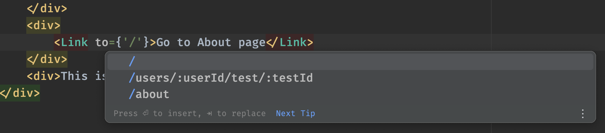
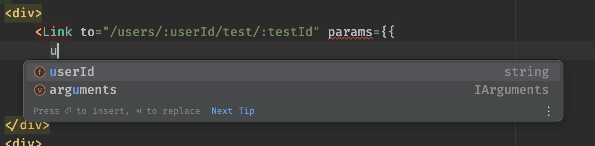
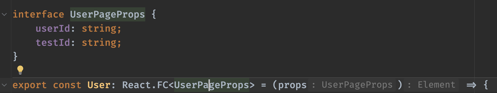
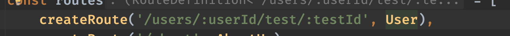
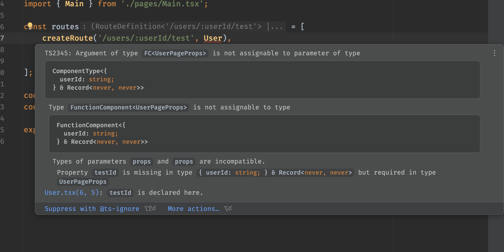

# Type Safe Minimalistic React Router

## Setup

```bash
npm install    # install dependencies

npm run test   # run tests
npm run lint   # run linter
npm run dev    # run demo app
npm run build  # build demo app
```

## Usage example

```js
const routes = [
    createRoute('/users/:userId/test/:testId', User),
    createRoute('/about', AboutUs),
    createRoute('/', Main),
];

const Link = createLink(routes);
const Router = createRouter(routes);
```

## Type safe routing

- path suggestions:



- parameter suggestions:




- instead of using useParams, I've decided to pass parameters as props to the component:
e.g. User component expects `userId` and `testId` parameters:



and the router passes them as props:



- if the route parameters doesn't match the props component expects, the typescript will throw an error:
e.g. here the user component expects testId prop but it's not provided in the route:




## Testing

There are integration and unit tests. To run them:

```bash
npm run test
```

